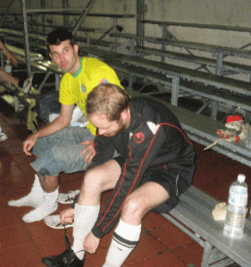

**Location:** Taipei American School

**Date:** Friday 26th June 8pm

**Starting Line-up:** Dale Neal, Tim Murphy, Lar Kenny, Kyle Painter, Steven Reymond, Eddie Painter, Ebrima Njie, Badou Njie, Alex Ramirez, Dan Calvert, Gustavo Lopez

**Subs:** Dawda Fatty for Eddie Painter.

How best to describe the man with the double barreled name Neil O'Maonaigh-Lennon? Enthusiastic, passionate, mad . . . call it what you will but one thing you can’t deny is the mark he made on this island of ours in the year or so he spent here. The Shane FC man’s swan song was [30 marathons in 30 days](http://www.marathonmad.com/) round the circumference of the island. In his spare time when he wasn’t running, leading the Mighty Shane or keeping the bars of Taipei in business, Taipei City FC were lucky enough to have him between the sticks for their championship winning season. Ah yes, its characters like him that they’ve struggled to replace.

So it was no surprise to anyone involved in [Taiwan football](http://www.taiwanfootball.tv/) that in the space of a year in Japan, Neil had managed to put together a group of English teachers from the greater Tokyo area to compete in the [Tokyo Metropolis League](http://www.footyjapan.com/tml/index.html) and carry on the work he had done for the [Shane franchise](http://www.shane.com.tw/en/) in Taipei.

The match itself proved to be a very tough test for the Shane boys who were happy to see a small set of five-a-side goals wheeled out before kick-off. The game started at a steady pace with City controlling it in every area of the field. Some lovely interchanges between the defence and midfield made for a nice game to watch, with City sticking to the game plan of short passing and ball retention in every area of the field.

The first real chance came from a nice exchange between Lar Kenny and Steven Reymond on the right wing, with a header from Dan Calvert going very close from the resulting cross. The continued pressure finally paid off when an excellent slide rule pass from Badou Njie was coolly put away by Calvert leaving Chris Anderson in the Shane goals with no chance. Shortly after Calvert went close again but this time Anderson was up to the job.

The Taipei City centre midfield pair of Ebrima and Badou Njie were firmly in control now and starting to toy with the Shane boys a little. An excellent one two down the left wing between Alex Ramirez and new boy Eddie Painter was crossed in beautifully to the oncoming Steven Reymond who narrowly missed with his header.

At the beginning of the second half Shane threw everything into getting an equalizer and ten minutes in City’s new keeper Dale Neal was adjudicated to have picked up a back pass that set up a short free and a great opportunity for the boys from Japan to get back on level terms. However a nice shot through the wall from Sam Aynsley was cleverly saved by Neal to keep his team ahead.

Taipei City continued to control the tempo of the game with every Shane attack being successfully snuffed out by their two debuting centre halves Lar Kenny and the young Kyle Painter under the guidance and leadership of the unfaltering sweeper Tim Murphy. Their ball retention and hard work allowed the team to set up attack after attack and wear the Shane boys down.

The play started to open up a little and a fast break set up Calvert again who this time shot over the bar. Calvert continued to link up well City’s array of potent attacking midfielders. This constant pressure finally paid off with Badou getting on the end of a fine worked passing move to make it 2-0. The Shane boys were looking a little jaded by now, obviously the shell shock of a night in the Brass Monkey with Neil followed by the King of Pop's death was starting to take its toll. The pressure continued with a lovely lay off from Calvert to Dawda whose shot went close to making it three. A similar effort from Ramirez also went close with the Anderson saving smartly to his right this time.

The game ended 2-0 with the City boys happy to get back playing together after a few months off over the summer. The Shane boys were delighted to get a run out against the former BML champions; however the main focus of their trip would be their game the following morning with Taipei Shane in the inaugural Shane Cup.

---
